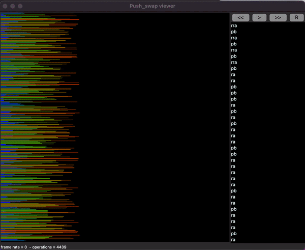
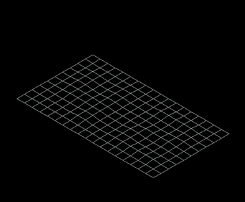
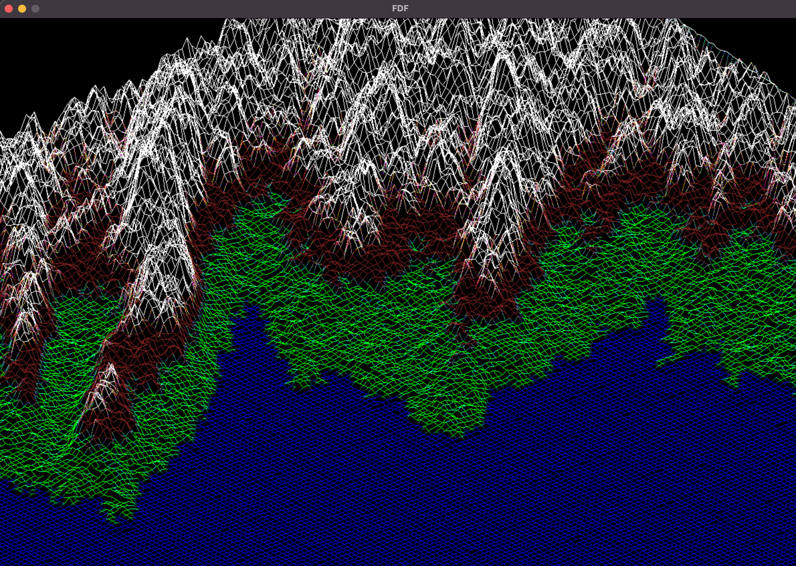
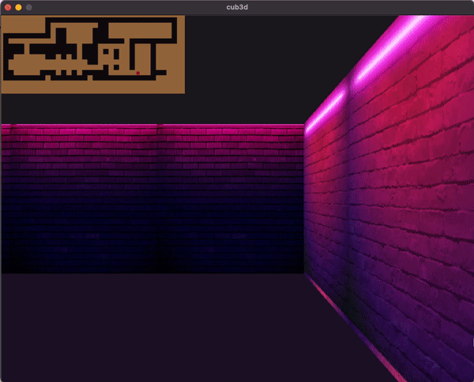
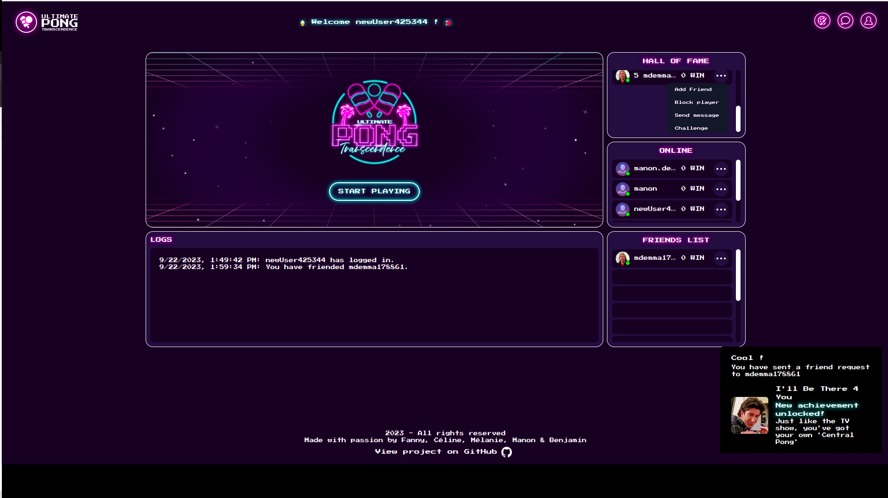

# Hi, I'm Manon

- 🌱 I'm currently learning C++, NestJS and NextJs at 42 School.
- 📫 How to reach me: 

## My Current Programming Languages or Frameworks

## Other Technical Skills

## Common-Core Projects at 42 School

| Project # | Project Name       | Language | Grade (Max: 100, Bonus: 125) | Objective             |
| --------- | ------------------ |--------- |----------------- | ----------------- |
| 1         | libft              | C | 125/100 | Recoding functions of the C standard library |
| 2         | ft_printf          | C | 100/100 | Recoding printf |
| 3         | get_next_line      | C |125/100 | Developing a tool to read from a file descriptor |
| 4         | Born2beRoot        | n/a | 125/100 | Introduction to virtualization |
| 5         | push_swap          | C | 125/100 | Developing an optimized sorting algorithm with a limited set of instructions |
| 6         | FdF	             | C | 125/100 | Graphic project to render map data into 'iron wire' meshing in 3D |
| 7         | pipex              | C | 125/100 | Recoding UNIX pipes |
| 8         | philosophers       | C | 100/100 | Solving the dining philosophers problem (multi-threading) |
| 9         | minishell          | C | 101/100 | Coding a simple shell |
| 10        | cube3d             | C | 125/100 | Creating a maze with dynamic view using ray-casting |
| 11        | CPP_Piscine        | C++ | 100/100 (9/9) | Learning the basics of C++ |
| 12        | Python_Piscine     | Python | 100/100 (1/2) | Learning the basics of Python with a data science approach |
| 13        | NetPractice     | n/a | 100/100 | Learning the basics of networking |
| 14        | webserv            | C++ | 100/100 | Coding our own HTTP server |
| 15        | inception          | n/a | 100/100 | Using Docker and creating customed Docker images |
| 16        | ft_transcendence   | NestJS / NextJS | 100/100 | Creating a real-time multiplayer online game with a chat |

## Post-Graduate Projects at 42 School

| Project # | Project Name       | Language | Grade (Max: 100, Bonus: 125) | Objective             |
| --------- | ------------------ |--------- |----------------- | ----------------- |
| 1         | Swingy              | Java | Pending | Designing and implementing a text-based RPG (console / GUI - Swing library) |
| 2         | Camagru         | PHP / Javascript | Pending | Coding an instagram-like website to create and share photo collages |
| 3         | ft_linear_regression      | Python | Pending | Small machine learning program implementing a descent gradient algorithm for price prediction |

## Quick Glimpses on School Projects
### [push_swap](https://github.com/madem23/Push-Swap)

  

### [FdF](https://github.com/madem23/FdF)

  
  

### [cube3D](https://github.com/madem23/Cub3D)

  

### [Transcendence](https://github.com/madem23/Transcendence)

  

